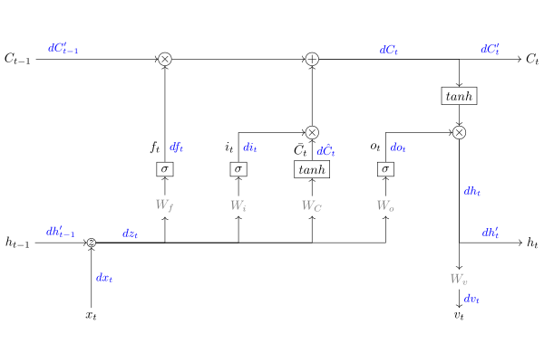

# TSAI Group Assignment

Group Members:

1. Arjun Gupta
2. Himanshu
3. Aeshna Singh
4. Palash Baranwal

## SESSION 4 - RNN & LSTM HANDS-ON

Rewrite the practice code, but this time remove the RNN and add LSTM.

---

## MODEL ARCHITECTURE

---
